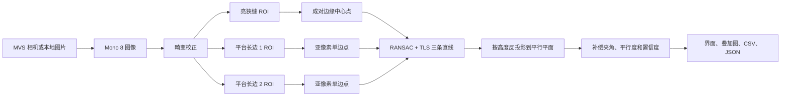

# MV-CS050-10UC 角度测量知识库

本知识库面向本项目的安装、开发、标定、调试和故障排查。它整合了 MV-CS050-10UM/UC 技术规格书、USB3.0 工业面阵相机用户手册 V3.0.4 和 MVL-MF2518M-5MPE 镜头技术规格书。

## 快速入口

| 想解决的问题 | 建议入口 |
|---|---|
| 查看相机分辨率、曝光、格式、接口 | [相机规格与项目参数](camera-spec.md) |
| 确定工作距离、视野或接圈 | [镜头规格与视野](lens-spec.md) |
| 安装 MVS、检查驱动、连接和触发 | [USB3 相机使用指南](usb3-camera-guide.md) |
| 调整光源、对焦、ROI 和阈值 | [项目现场调试](project-tuning.md) |
| 打印棋盘格并完成标定 | [标定指南](../guides/calibration.md) |
| 配置 SDK Python 路径 | [MVS SDK 配置](../guides/mvs-sdk-setup.md) |
| 操作测量程序 | [操作指南](../guides/operator-guide.md) |
| 回到原手册章节或 PDF 页码 | [资料索引](source-index.md) |

## 本项目的默认决策

- 静态目标、人工放置、位置小幅偏移
- 结果定义为平台 XY 坐标系内 0°～90°的较小夹角
- MV-CS050-10UC 使用 Mono 8、软件触发、手动曝光、低增益
- 镜头使用 F8，并在当前基础上把相机抬高约 50～100 mm、焦点调在顶部狭缝面与底座边缘面之间；本镜头没有 F11，F16 只作衍射与重复性对比
- 环形 LED 亮度固定；高光明显时调整入射几何或增加偏振
- 使用三个可旋转测量带，分别约束亮狭缝中心和矩形底座两条长边
- 正式结果必须具有内参、平台姿态及从底座参考面到狭缝平面的固定高度差

## 系统数据流

## 资料使用优先级

1. 型号专属数值以相机和镜头技术规格书为准。
2. 安装、接线、MVS 操作和通用功能以 USB3.0 相机用户手册为准。
3. 本知识库中的“项目建议”是针对当前静态测角场景的工程选择，不代表厂商对所有场景的通用推荐。
4. [原始文本提取](source-extracts/)便于全文搜索，但表格和图形可能错位；关键操作应通过资料索引返回源 PDF 原页核验。
